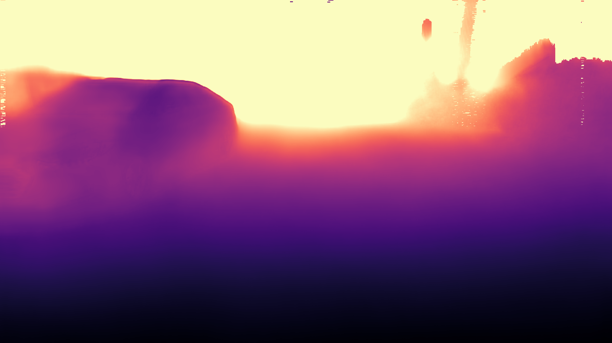
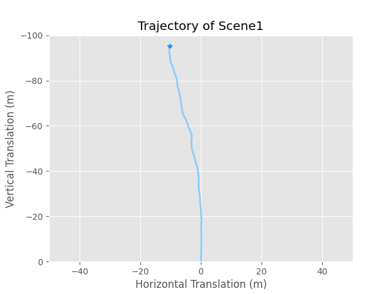
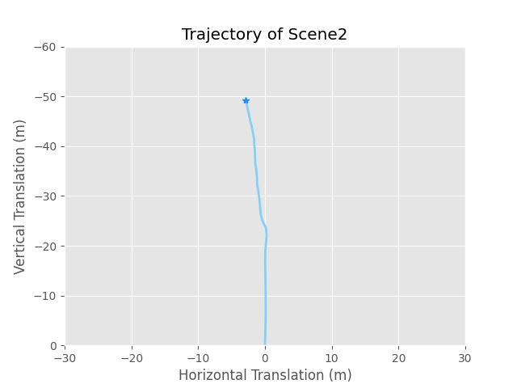

# Foreground Mask & Trajectory Estimation & 3D Geometry Learning of HoleSpot 

## Results of Depth:


## Results of Trajectory On Scene 1:


## Results of Trajectory On Scene 2:


## Generating Mask for Foreground:
```
Python sky_mask.py
```

## Training:
```
sh start2train.sh
# Trained weights will be saved to mono_model/log1/
```

## Evaluating Depth Estimation 
```
sh start2eval.sh
```

## Evaluating Trajectory Estimation 
```
sh start2eval_pose.sh
```

#### Acknowledgement
 Thanks the authors for their works:
 - [monodepth2](https://github.com/nianticlabs/monodepth2)
 - [HRNet](https://github.com/HRNet/HRNet-Semantic-Segmentation)
- [DIFFNET](https://github.com/brandleyzhou/DIFFNet/tree/a4d74f131738bdb1f8feaa52baa58de3697959e7)

